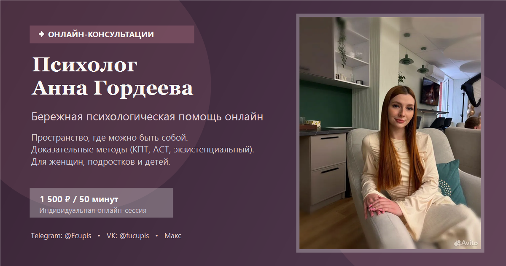

# 🕊️ Лендинг для психолога Анны Гордеевой

[](https://developer.mozilla.org/ru/docs/Web/HTML)
[](https://developer.mozilla.org/ru/docs/Web/CSS)
[](https://developer.mozilla.org/ru/docs/Web/JavaScript)
[](https://core.telegram.org/bots/api)
[](https://web3forms.com)

> **Премиальный, авторский и полностью адаптивный сайт-лендинг для частнопрактикующего психолога Анны Гордеевой.**  
> Разработан в утончённой редакторской эстетике *«Deep Velvet Fig & Cashmere Silk»* (глубокий инжирный бархат и кашемировый шёлк) с мгновенной доставкой заявок в Telegram-бот и на email.

---

## 📸 Превью проекта



---

## 🌟 Ключевые особенности и функциональность

### 1. ⚡ Мгновенные уведомления о заявках (Двойной шлюз)
- **Telegram Bot API:** При отправке формы заявки бот моментально присылает структурированное сообщение в личный чат психолога с именем клиента, контактом, выбранной услугой, предпочтительным временем суток и комментарием.
- **Web3Forms Gateway:** Параллельное дублирование всех заявок на почту `kizamaziza@gmail.com`.
- **Защита данных:** Экранирование спецсимволов для безопасности HTML-разметки Telegram.

### 2. 🎨 Авторская дизайн-система и палитра
- Уход от шаблонных крафтово-зелёных тонов в сторону европейской редакторской эстетики:
  - Основной акцентный тон: глубокий инжирно-сливовый бархат (`#533B50` / `#3B2639`).
  - Фоновое полотно: шелковистый фарфор (`#FAF8F5`).
  - Тонкие пудрово-розовые акценты (`#A66B7D`).
- **Векторная микрографика (SVG):** Все разнородные любительские эмодзи заменены на лаконичные векторные SVG-иконки единого начертания.

### 3. 💬 Социальное доказательство (Блок отзывов)
- 4 подробные реальные истории клиентов (выгорание, границы, сепарация, работа с подростком).
- Метки длительности терапии, подходов (КПТ, ACT, экзистенциальный) и знаки верификации.
- Плашка соблюдения этического кодекса и тайны психологической помощи.

### 4. 🕐 Гибкий выбор времени для онлайн-встречи
- Клиент может выбрать удобный интервал: *Утро (10:00–14:00 МСК)*, *День (14:00–18:00 МСК)*, *Вечер (18:00–21:00 МСК)*, *Выходные* или *Любое время*.

### 5. 📱 Полная адаптивность (Mobile First)
- Безупречное отображение на экранах смартфонов (iPhone, Android), планшетов (iPad) и широкоформатных мониторах.
- Стеклянный липкий хедер (Glassmorphism), боковое мобильное меню-шторка и плавающий виджет быстрого вызова мессенджеров.
- Двусторонняя плавная анимация появления блоков при скролле (с автоскрытием при прокрутке вверх).

### 6. 🌐 Техническая упаковка и SEO
- Настроены теги **OpenGraph** и **Twitter Cards** для формирования сочных превью при отправке ссылки в Telegram, VK и WhatsApp.
- Векторная адаптивная фавиконка (`favicon.svg` и `favicon.png`).

---

## 📞 Прямые каналы связи со специалистом

- **Telegram:** [@Fcupls](https://t.me/Fcupls)
- **VK:** [@fucupls](https://vk.com/fucupls)
- **Макс:** [+7 995 474 56 27](https://max.ru/+79954745627)
- **Email:** [kizamaziza@gmail.com](mailto:kizamaziza@gmail.com)

---

## 🛠️ Стек технологий

- **HTML5:** Семантическая вёрстка, доступность (a11y), мета-теги OpenGraph.
- **CSS3:** Flexbox, CSS Grid, Custom Properties (CSS-переменные), Glassmorphism, медиа-запросы, плавные переходы.
- **JavaScript (Vanilla ES6+):** Intersection Observer API, асинхронный Fetch API, Telegram Bot API, валидация и форматирование форм, Clipboard API.
- **Типографика:** Google Fonts (*Cormorant Garamond* & *Plus Jakarta Sans*).

---

## 🚀 Быстрый запуск

1. Склонируйте репозиторий:
   ```bash
   git clone https://github.com/DanilLisenko/anna-gordeeva-lending.git
   ```
2. Откройте файл `index.html` в любом браузере (или используйте расширение *Live Server* в VS Code).
